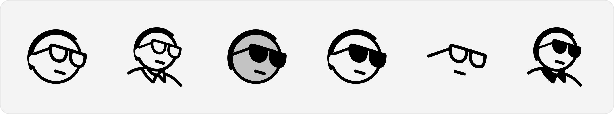
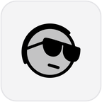
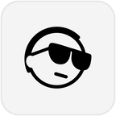
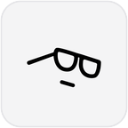
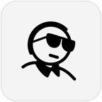

<p align="center">
  <picture>
    <source media="(prefers-color-scheme: dark)" srcset="assets/preview-dark.png">
    
  </picture>
</p>

<h1 align="center">shadcn avatar icons</h1>

<p align="center">
  Six free SVG icons of the <a href="https://github.com/shadcn">shadcn</a> avatar, drawn on a 24 × 24 grid
  so they sit naturally next to <a href="https://lucide.dev">Lucide</a> in any <a href="https://ui.shadcn.com">shadcn/ui</a> project.
  <br>Made by Eugenia Pastore · <a href="https://x.com/eugypastore">@eugypastore</a> on X
</p>

<p align="center">
  <a href="LICENSE"></a>
  <a href="https://github.com/EugyPastore/shadcn-avatar-icons/releases/latest"></a>
  <a href="https://github.com/EugyPastore/shadcn-avatar-icons/stargazers"></a>
</p>

> **Unofficial.** This is fan art made with love. It is not affiliated with or endorsed by shadcn.

## The icons

| | Name | Description | Download |
|:-:|---|---|---|
| <picture><source media="(prefers-color-scheme: dark)" srcset="assets/thumbs-dark/shadcn-avatar-a.png"></picture> | `shadcn-avatar-a` | Face with clear glasses | [SVG](svg/shadcn-avatar-a.svg) · [PNG](png/512/shadcn-avatar-a.png) |
| <picture><source media="(prefers-color-scheme: dark)" srcset="assets/thumbs-dark/shadcn-avatar-b.png"></picture> | `shadcn-avatar-b` | Head and shoulders, clear glasses | [SVG](svg/shadcn-avatar-b.svg) · [PNG](png/512/shadcn-avatar-b.png) |
| <picture><source media="(prefers-color-scheme: dark)" srcset="assets/thumbs-dark/shadcn-avatar-c.png"></picture> | `shadcn-avatar-c` | Dark sunglasses with a tinted face | [SVG](svg/shadcn-avatar-c.svg) · [PNG](png/512/shadcn-avatar-c.png) |
| <picture><source media="(prefers-color-scheme: dark)" srcset="assets/thumbs-dark/shadcn-avatar-d.png"></picture> | `shadcn-avatar-d` | Face with dark sunglasses | [SVG](svg/shadcn-avatar-d.svg) · [PNG](png/512/shadcn-avatar-d.png) |
| <picture><source media="(prefers-color-scheme: dark)" srcset="assets/thumbs-dark/shadcn-avatar-e.png"></picture> | `shadcn-avatar-e` | Just the glasses and the mouth | [SVG](svg/shadcn-avatar-e.svg) · [PNG](png/512/shadcn-avatar-e.png) |
| <picture><source media="(prefers-color-scheme: dark)" srcset="assets/thumbs-dark/shadcn-avatar-f.png"></picture> | `shadcn-avatar-f` | Head and shoulders, dark sunglasses | [SVG](svg/shadcn-avatar-f.svg) · [PNG](png/512/shadcn-avatar-f.png) |

**Want everything at once?** Download the [latest release zip](https://github.com/EugyPastore/shadcn-avatar-icons/releases/latest) (SVG + PNG + React), or use **Code → Download ZIP** above.

## Usage

### SVG (works anywhere)

Every icon uses `currentColor`, so it takes the surrounding text color and works in dark mode with no extra work.

```html
<!-- as an image -->


<!-- inline, styled with Tailwind -->
<svg class="size-6 text-foreground" viewBox="0 0 24 24" fill="none">…</svg>
```

### React (the shadcn way: copy, paste, own it)

Copy any file from [`react/`](react) into your project, for example `components/icons/shadcn-avatar-a.tsx`.
The components have no dependencies besides React, accept every normal SVG prop, and work in Server Components.

```tsx
import { ShadcnAvatarA } from "@/components/icons/shadcn-avatar-a"

export function Example() {
  return (
    <>
      <ShadcnAvatarA className="size-5 text-muted-foreground" />
      <ShadcnAvatarA size={32} />
    </>
  )
}
```

### PNG

[`png/`](png) has every icon at 128, 256 and 512 px, black on a transparent background, exported from the original design file.
Handy for avatars, Slack, Notion, Figma or anywhere SVG is not an option.

## Design notes

- 24 × 24 px grid, the same grid Lucide uses
- 1 px stroke, rounded corners, expanded to filled paths so nothing depends on stroke settings
- One color via `currentColor`; icon C tints the face at 20 % opacity
- Optimized with SVGO, 1.4 to 3.2 KB per file

## Repository layout

```
svg/       optimized SVG sources, start here
png/       PNG exports at 128 / 256 / 512 px
react/     one self-contained React component per icon (TSX)
assets/    README preview images
scripts/   build scripts: SVG → React and SVG → README previews
```

## Contributing

Ideas for another variant? [Open an issue](https://github.com/EugyPastore/shadcn-avatar-icons/issues).
If you edit an SVG, run `npm install` once and then `npm run build` to regenerate the React components and previews.

## License

[MIT](LICENSE) © 2026 [Eugenia Pastore](https://github.com/EugyPastore) · [@eugypastore](https://x.com/eugypastore)
Free for personal and commercial use. Keep the license notice if you redistribute the files; a link back is always appreciated.

If these are useful to you, a ⭐ on the repo helps other people find them.
